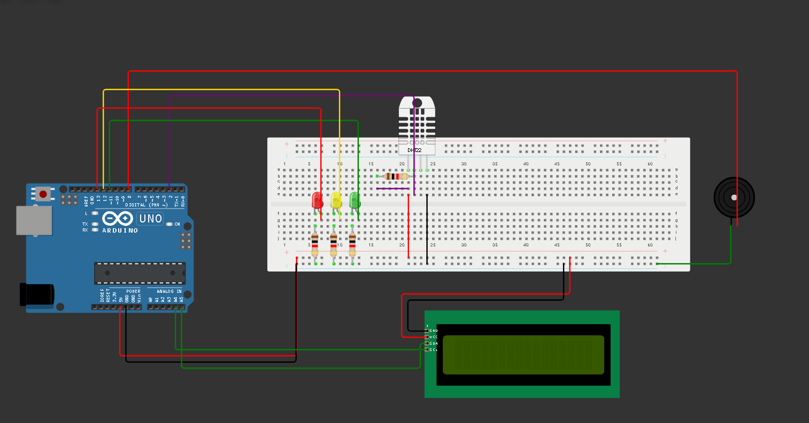

🥸 Menbros da equipe Vigia Enchente:
 
Artur Distrutti Rm561319
Alexandre freitas Rm566278
Felipe Rodrigues Rm562482

------------------------------------------------------------------------------------------------------------------------------------------
🎯Objetivos:
Fazer um componente que ajude as pessoas a identificarem a umidade do ar.
------------------------------------------------------------------------------------------------------------------------------------------
🕹️ Itens usados para fazer o sensor:
3 leds,
4 resistores,
1 protoboard,
1 tela LCD,
1 buzzer,
1 Arduino,
1 DHT22.

------------------------------------------------------------------------------------------------------------------------------------------
🔗Link do vídeo:
🔗Link do Video do arduino: https://youtu.be/0cmee0SxxN4

------------------------------------------------------------------------------------------------------------------------------------------
📔Bibliotecas usadas:
LiquidCrystal I2C,
DHT sensor library,
DHT sensor library,
------------------------------------------------------------------------------------------------------------------------------------------

🖥️Como simular o nosso projeto:
Copie o código arduino e cole ele no Wokiwi ou no tinkercad (o de sua preferencia)
monte o arduino igual a imagem a seguir: